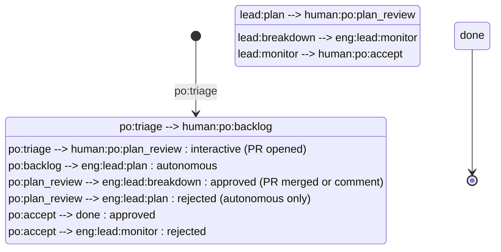
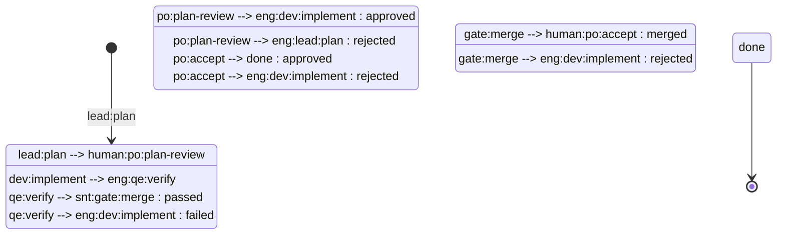
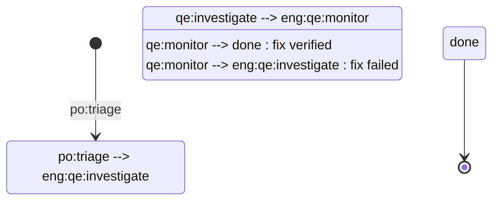

# Agentic SDLC Planning — Process

This document defines the conventions used by the agentic-sdlc-planning team profile. All hats follow these formats when creating and updating issues, milestones, PRs, and comments on GitHub. All GitHub operations go through the `github-project` skill.

The agentic-sdlc-planning profile has three members:

| Member | Role Slug | Description |
|--------|-----------|-------------|
| **engineer** | `eng` | The primary execution agent — self-transitions through the full issue lifecycle wearing different hats (po, lead, dev, qe, sre, cw). |
| **chief-of-staff** | `cos` | Coordinates process improvements, team-level tasks, and operational health. |
| **sentinel** | `snt` | Automated merge gating — runs tests, validates quality, merges or rejects PRs. |

---

## Core Principles

### Entry at Any Level (WIM-02)

Work can begin at any granularity level without creating parent containers:

| Entry Point | What Happens |
|-------------|-------------|
| **Epic** | Full PDD pipeline: idea → requirements → design → plan → stories → tasks |
| **Story** | Code-task-generator decomposes into tasks, then implementation |
| **Task** | Direct implementation in a Ralph loop — no decomposition step |
| **Bug** | Investigation → linked Story (simple or complex path) |

### Two-Touch-Point Contract (WIM-04)

Every implemented change passes through two human touch points:

1. **Specification (before):** Human reviews planning artifacts at `human:po:plan-review`
2. **Verification (after):** Human accepts completed work at `human:po:accept`

Both gates can be auto-advanced with `plan:auto` and `accept:auto` labels respectively.

### Planning Depth Scales with Scope (WIM-03)

| Scope | Planning Artifacts | Planning Skill |
|-------|-------------------|----------------|
| Epic | requirements.md, design.md, plan.md (stories) | PDD |
| Story | .code-task-NN.md files + catalog README | code-task-generator |
| Task | None — task IS the unit of work | Agent runtime |
| Bug | Investigation notes → linked Story | QE investigation |

---

## Issue Format

Issues are GitHub issues on the **team repo** (not the project repo). The `github-project` skill auto-detects the team repo from `team/`'s git remote.

### Fields

| Field | GitHub Mapping | Description |
|-------|---------------|-------------|
| `title` | Issue title | Concise, descriptive issue title |
| `state` | Issue state | `open` or `closed` |
| `type` | Native issue type | Epic, Task (story), Bug |
| `assignee` | Issue assignee | GitHub username or unassigned |
| `milestone` | Issue milestone | Milestone name or none |
| `parent` | Native sub-issue relationship | Links stories to their parent epic |
| `body` | Issue body | Description, acceptance criteria, and context (markdown) |

Issues are created via the `github-project` skill (create-issue operation). See the skill for exact commands.

---

## Issue Types

Issue classification uses GitHub's native issue types:

| Issue Type | Kind | Description |
|------------|------|-------------|
| **Epic** | `epic` | A large body of work spanning multiple stories |
| **Task** | `story` | A single deliverable unit of work (sub-issue of an Epic, or standalone) |
| **Bug** | `bug` | A defect requiring investigation and fix |

Stories are linked to epics as native sub-issues.
Tasks within stories are externalized as sub-issues (default), inline sub-issues (`tasks:inline`), or file-only (`tasks:off`).

Every issue MUST have exactly one issue type set.

### Labels

Labels are used as modifiers on any issue type, not for classification:

| Label | Description |
|-------|-------------|
| `kind/docs` | Routes the issue to content writer hats for documentation work |
| `role/*` | Assigns the issue to a specific role |
| `project/<project>` | Associates the issue with a specific project. Every issue MUST have exactly one `project/<project>` label. |
| `plan:auto` | Auto-advance at `human:po:plan-review` — skip human approval for planning |
| `accept:auto` | Auto-advance at `human:po:accept` — skip human acceptance |
| `tasks:inline` | Track tasks as inline sub-issues instead of separate issues |
| `tasks:off` | Track tasks only as `.code-task-NN.md` files (no GitHub issues) |
| `agent-internal` | Agent-internal task — excluded from default board view |
| `bug:simple` | Simple bug — fast path without complexity analysis |
| `bug:complex` | Complex bug — full planning path with story creation |
| `planning:backward-generate` | Trigger backward artifact generation for the work item |

---

## Project Status Convention

Status is tracked via a single-select "Status" field on the team's GitHub Project board (v2). Status values follow the naming pattern:

```
<role-slug>:<persona>:<activity>
```

- `<role-slug>` — the team member responsible: `eng` (engineer), `cos` (chief-of-staff), `snt` (sentinel), or `human` (human gates)
- `<persona>` — the hat/persona acting within that member (e.g., `po`, `lead`, `dev`, `qe`, `exec`, `gate`)
- `<activity>` — the current activity within that persona's workflow (e.g., `triage`, `plan`, `implement`, `verify`, `merge`)

**Exception:** `done` is the terminal status with no role prefix.

### Role Slug Reference

| Slug | Member | Meaning |
|------|--------|---------|
| `eng` | engineer | The primary execution agent wearing various hats |
| `cos` | chief-of-staff | Team coordination and process management |
| `snt` | sentinel | Automated quality and merge gating |
| `human` | (operator) | Human decision gates — requires human response via GitHub comments |

### Examples

- `eng:lead:plan` — the engineer (wearing the lead hat) is creating planning artifacts
- `eng:dev:implement` — the engineer (wearing the dev hat) is implementing the story
- `eng:qe:verify` — the engineer (wearing the QE hat) is verifying the implementation
- `human:po:plan-review` — a human must review and approve the planning artifacts
- `snt:gate:merge` — the sentinel is running merge checks
- `cos:exec:in-progress` — the chief-of-staff is executing a task

The engineer self-transitions through all `eng:*` statuses by switching hats. Comment headers still use the persona of the active hat for audit trail clarity.

The `human:` prefix clearly distinguishes statuses that require a human response from agent-automated statuses. Agents NEVER auto-advance `human:*` statuses unless the appropriate auto-label is present (`plan:auto` or `accept:auto`).

---

## Epic Lifecycle (8 Statuses)

The epic lifecycle passes through planning, human review, breakdown, monitoring, and acceptance. Planning can happen via two paths — interactive (human-driven) or autonomous (agent-driven):

| Status | Persona | Description |
|--------|---------|-------------|
| `human:po:triage` | PO (human) | New epic, awaiting human evaluation |
| `human:po:backlog` | PO (human) | Accepted, prioritized, awaiting activation |
| `eng:lead:plan` | lead | Creating planning artifacts autonomously (PDD pipeline) |
| `human:po:plan-review` | PO (human) | Planning artifacts awaiting human review (PR or issue comment) |
| `eng:lead:breakdown` | lead | Creating story issues from the story breakdown |
| `eng:lead:monitor` | lead | Monitoring story execution, advances when all stories done |
| `human:po:accept` | PO (human) | Epic awaiting human acceptance |
| `done` | -- | Epic complete |

### Two Planning Paths

| Path | Trigger | Flow | Plan Review Mechanism |
|------|---------|------|-----------------------|
| **Interactive** | Human starts PDD conversation directly | `human:po:triage` → PDD conversation → PR opened → `human:po:plan-review` → PR merged → `eng:lead:breakdown` | PR merge = approval |
| **Autonomous** | Agent picks up from board | `human:po:backlog` → `eng:lead:plan` → PDD autonomous → `human:po:plan-review` → issue comment approval → `eng:lead:breakdown` | Issue comment approval |

**Interactive path:** The human and agent collaborate on planning in a conversation. The epic issue is created at the start (in `human:po:triage`). When planning is complete, a PR is opened with the spec artifacts linked to the epic, and the issue moves directly to `human:po:plan-review` — skipping `eng:lead:plan` since the human was part of the planning. Merging the PR = plan approval, which advances the issue to `eng:lead:breakdown`.

**Autonomous path:** The agent picks up the epic from `human:po:backlog`, moves it to `eng:lead:plan`, runs the PDD pipeline autonomously with adversarial review, then moves to `human:po:plan-review`. The human reviews via issue comments. Approval advances to `eng:lead:breakdown`.



### Epic Rejection Loops

At human review gates, the human can reject and send the epic back:
- `human:po:plan-review` -> `eng:lead:plan` (autonomous path — with feedback comment)
- `human:po:plan-review` -> PR feedback (interactive path — request changes on the PR)
- `human:po:accept` -> `eng:lead:monitor` (with feedback comment)

### Internal Review within `eng:lead:plan`

Adversarial review is internal to the `eng:lead:plan` status (autonomous path only) — it is NOT a separate board status. The `lead_plan-create` hat produces planning artifacts, then the `lead_plan-review` hat reviews them as an internal quality gate before transitioning to `human:po:plan-review`. This keeps the board simple while maintaining review rigor.

---

## Story Lifecycle (7 Statuses)

Stories share `eng:lead:plan`, `human:po:plan-review`, and `human:po:accept` with the epic lifecycle. At `eng:lead:plan`, the lead hat checks the issue type — epic triggers PDD, story triggers code-task-generator:

| Status | Persona | Description |
|--------|---------|-------------|
| `eng:lead:plan` | lead | Creating planning artifacts (code-task-generator for stories) |
| `human:po:plan-review` | PO (human) | Planning artifacts awaiting human review |
| `eng:dev:implement` | dev | TDD implementation (red-green-refactor-review cycle) |
| `eng:qe:verify` | QE | Verifying implementation against acceptance criteria |
| `snt:gate:merge` | sentinel | Sentinel runs tests, validates quality, merges or rejects |
| `human:po:accept` | PO (human) | Story awaiting human acceptance |
| `done` | -- | Story complete |



### Story Rejection Loops

- `human:po:plan-review` -> `eng:lead:plan` (plan rejected with feedback)
- `eng:qe:verify` -> `eng:dev:implement` (QE rejects with feedback)
- `snt:gate:merge` -> `eng:dev:implement` (sentinel rejects — tests fail or quality gate not met)
- `human:po:accept` -> `eng:dev:implement` (human rejects with feedback)

---

## Bug Lifecycle (4 Statuses)

Every confirmed bug creates a linked Story. The bug workflow is lightweight — investigation plus monitoring:

| Status | Persona | Description |
|--------|---------|-------------|
| `human:po:triage` | PO (human) | New bug, awaiting human evaluation (shared with epic) |
| `eng:qe:investigate` | QE | QE reproduces bug, confirms it, creates a linked Story |
| `eng:qe:monitor` | QE | Monitors linked Story progress, verifies fix when Story completes |
| `done` | -- | Bug complete |



### Simple vs Complex Bugs

Bug complexity determines the linked Story's treatment:

| Classification | How Determined | Story Treatment |
|---------------|----------------|-----------------|
| **Simple** | `bug:simple` label, or agent judgment | Story gets `plan:auto` label — planning auto-approved |
| **Complex** | `bug:complex` label, or agent judgment | Story goes through full human-gated planning cycle |

If neither `bug:simple` nor `bug:complex` label is present, the agent determines complexity during investigation. Default is simple.

During `eng:qe:investigate`, QE:
1. Reproduces the bug
2. Determines root cause
3. Creates a linked Story issue
4. Applies `plan:auto` for simple bugs (or leaves unlabeled for complex)
5. Transitions the bug to `eng:qe:monitor`

The bug sits in `eng:qe:monitor` while the linked Story runs through its full lifecycle. When the Story reaches `done`, QE verifies the original bug is resolved and closes it.

---

## Chief of Staff Statuses

| Status | Persona | Description |
|--------|---------|-------------|
| `cos:exec:todo` | executor | Task queued for chief-of-staff execution |
| `cos:exec:in-progress` | executor | Chief-of-staff is actively working the task |
| `cos:exec:done` | executor | Task completed by chief-of-staff |

---

## Human Gates

The following statuses require explicit human approval via GitHub issue comments. The `human:` prefix distinguishes these from agent-automated statuses. Agents MUST NOT auto-advance any `human:*` status unless the appropriate auto-label is present.

| Gate | Status | What's Presented | Auto-Label |
|------|--------|-----------------|------------|
| Triage | `human:po:triage` | New issue for evaluation | -- |
| Backlog | `human:po:backlog` | Prioritized issue for activation | -- |
| Plan approval | `human:po:plan-review` | Planning artifacts (PDD output or code-task catalog) | `plan:auto` |
| Final acceptance | `human:po:accept` | Completed work summary | `accept:auto` |

### How approval works

1. The agent adds a **review request comment** on the issue summarizing the artifact
2. The agent **returns control** and moves on to other work
3. The **human** reviews the artifact on GitHub and responds via an issue comment:
   - `Approved` (or `LGTM`) -> agent advances the status on the next scan cycle
   - `Rejected: <feedback>` -> agent reverts the status and appends the feedback
4. If no human comment is found, the issue stays at its review status — **the agent NEVER auto-approves** (unless auto-label is present)

### Auto-Advance Labels

- `plan:auto` at `human:po:plan-review`: The `po_gate` hat auto-advances with a comment noting auto-approval. Useful for simple bugs and trusted planning.
- `accept:auto` at `human:po:accept`: The `po_gate` hat auto-advances with a comment noting auto-acceptance. Useful for low-risk work items.

### Idempotency

The agent adds only ONE review request comment per review gate. On subsequent scan cycles, it checks for a human response but does NOT re-comment if a review request is already present.

---

## Sentinel Merge Gate

The sentinel member handles `snt:gate:merge`. Unlike auto-advance statuses, the sentinel actively validates before merging:

1. **Runs the project's test suite** — all tests must pass
2. **Checks code quality gates** — linting, formatting, coverage thresholds
3. **Validates PR metadata** — title format, linked issues, labels
4. **Merges the PR** via `gh pr merge` if all checks pass
5. **Rejects** by setting status back to `eng:dev:implement` with a feedback comment if any check fails

Per-project merge gate configuration lives at `team/projects/<project>/knowledge/merge-gate.md`. This file defines project-specific test commands, coverage thresholds, and quality requirements the sentinel enforces.

---

## Artifact Storage Convention

Planning artifacts are stored in the team repo under `specs/`:

```
specs/
  index.md                           # Catalog of all work items and their artifacts
  <project>/                         # Per-project directory
    <issue#>-<slug>/                 # Per-work-item directory
      requirements.md                # Requirements (epics)
      design.md                      # Design document (epics)
      plan.md                        # Story breakdown (epics)
      tasks/                         # Code task files (stories)
        .code-task-01.md
        .code-task-02.md
        README.md                    # Task catalog
```

The `specs/index.md` file serves as a catalog of all work items with pointers to their artifacts.

---

## Task Externalization

Tasks decomposed from stories can be externalized in three modes:

| Mode | Label | Behavior |
|------|-------|----------|
| **Full issues** (default) | -- | Each task becomes a GitHub issue with `agent-internal` label |
| **Inline sub-issues** | `tasks:inline` | Tasks tracked as sub-issues inside the parent story |
| **File-only** | `tasks:off` | Tasks exist only as `.code-task-NN.md` files in the repo |

Agent-internal tasks (with `agent-internal` label) are excluded from the default board view.

---

## Comment Format

Comments are GitHub issue comments, added via `gh issue comment`. Each comment uses this format:

```markdown
### <emoji> <persona> — <ISO-8601-UTC-timestamp>

Comment text here. May contain markdown formatting, code blocks, etc.
```

The `<emoji>` and `<persona>` are read from the member's `.botminter.yml` file at runtime by the `github-project` skill. Each member has its own GitHub App identity (e.g., `team-engineer[bot]`). The persona attribution in the comment body provides additional context about which hat/persona wrote the comment.

### Standard Emoji Mapping

| Persona | Emoji | Example Header |
|---------|-------|----------------|
| po | 📝 | `### 📝 po — 2026-01-15T10:30:00Z` |
| lead | 👑 | `### 👑 lead — 2026-01-15T10:30:00Z` |
| dev | 💻 | `### 💻 dev — 2026-01-15T10:30:00Z` |
| qe | 🧪 | `### 🧪 qe — 2026-01-15T10:30:00Z` |
| sre | 🛠️ | `### 🛠️ sre — 2026-01-15T10:30:00Z` |
| cw | ✍️ | `### ✍️ cw — 2026-01-15T10:30:00Z` |

The three team members map to these comment personas as follows:

| Member | Role Slug | Comment Personas Used |
|--------|-----------|----------------------|
| **engineer** | `eng` | po, lead, dev, qe, sre, cw (all execution personas) |
| **chief-of-staff** | `cos` | Uses `📋 cos` header for all comments |
| **sentinel** | `snt` | Uses `🛡️ sentinel` header for all comments |

Comments are append-only. Never edit or delete existing comments.

---

## Milestone Format

Milestones are GitHub milestones on the team repo, managed via the `github-project` skill.

**Fields:**

| Field | GitHub Mapping | Description |
|-------|---------------|-------------|
| `title` | Milestone title | Milestone name (e.g., `M1: Initial setup`) |
| `state` | Milestone state | `open` or `closed` |
| `description` | Milestone description | Goals and scope of the milestone |
| `due_on` | Milestone due date | Optional ISO 8601 date |

Issues are assigned to milestones via the `github-project` skill (milestone-ops operation).

---

## Pull Request Format

Pull requests are real GitHub PRs on the **project repo** for code changes and on the **team repo** for team evolution changes.

**Fields:**

| Field | GitHub Mapping | Description |
|-------|---------------|-------------|
| `title` | PR title | Descriptive title of the change |
| `state` | PR state | `open`, `merged`, or `closed` |
| `base` | Base branch | Target branch (usually `main`) |
| `head` | Head branch | Feature branch |
| `labels` | PR labels | e.g., `kind/process-change` |
| `body` | PR body | Description of the change (markdown) |

### Reviews

Reviews use GitHub's native review system via `gh pr review`:

- `gh pr review <number> --approve` — approve the PR
- `gh pr review <number> --request-changes` — request changes

Review comments follow the standard comment format with an explicit status:

```markdown
### <emoji> <persona> — <ISO-8601-UTC-timestamp>

**Status: approved**

Review comments here.
```

Valid review statuses: `approved`, `changes-requested`.

---

## PR Lifecycle

Code PRs follow a structured lifecycle tied to the story workflow.

### Branch Naming

```
feature/<type>-<issue-number>-<description>
```

Examples:
- `feature/story-42-add-user-auth`
- `feature/bug-87-fix-null-pointer`
- `feature/docs-15-api-reference`

### PR Title Format

```
[#<issue-number>] <description>
```

Examples:
- `[#42] Add user authentication module`
- `[#87] Fix null pointer in session handler`

### PR Creation and Lifecycle

1. **Draft PR created during `eng:dev:implement`** — the developer creates a draft PR with the implementation branch. This establishes the PR early for visibility and links it to the issue.

2. **PR marked ready during `eng:dev:implement`** — when implementation is complete and internal code review passes, the PR is marked ready for review.

3. **Merge gated by sentinel at `snt:gate:merge`** — the sentinel validates all quality gates and merges the PR. No manual merge is permitted.

### Merge Gate Configuration

Each project defines its merge gate requirements at:

```
team/projects/<project>/knowledge/merge-gate.md
```

This file specifies:
- Test commands to run before merge
- Coverage thresholds
- Required status checks
- Merge strategy (squash, merge commit, rebase)

If no `merge-gate.md` exists, the sentinel uses default checks (all CI passes, at least one approval).

### Team Repo PRs

PRs on the team repo are for team-level changes only:
- Process document updates
- Knowledge file additions or modifications
- Invariant changes

These follow the same review format but are NOT gated by the sentinel — they are reviewed and merged by team members directly.

---

## Communication Protocols

The agentic-sdlc-planning profile uses a three-member model. All operations use the `github-project` skill:

### Status Transitions

The agent transitions an issue's status by:
1. Using `gh project item-edit` to update the Status field on the project board
2. Adding an attribution comment documenting the transition

The board scanner detects the new status on the next scan cycle (querying the project board via `gh project item-list`) and dispatches the appropriate hat on the appropriate member.

### Comments

The agent records work output by:
1. Adding a GitHub issue comment via `gh issue comment` using the standard comment format

### Pull Requests

Code PRs on the project repo follow the PR Lifecycle section above.

Team repo PRs are for team-level changes:
- Process document updates
- Knowledge file additions or modifications
- Invariant changes

---

## Team Agreements

All significant process changes, role changes, and team decisions MUST be recorded as team agreements before the change is applied. Agreements provide traceability for why changes were made and who participated in the decision.

- **Decisions** go in `agreements/decisions/` — role changes, process changes, tool adoption
- **Retrospective outcomes** go in `agreements/retros/` — summaries from retrospective sessions
- **Working norms** go in `agreements/norms/` — living team agreements (e.g., "we prefer small PRs")

See `knowledge/team-agreements.md` for the full convention including file format and lifecycle.

---

## Process Evolution

The team process can evolve through two paths:

### Formal Path

1. Create a PR on the team repo proposing the change
2. Review the PR (self-review via lead hat)
3. Approve and merge

### Informal Path

1. Human comments on an issue or the team repo with the change request
2. Agent edits the process file directly
3. Commit the change to the team repo

The informal path is appropriate for urgent corrections or clarifications. The formal path is preferred for significant process changes.
