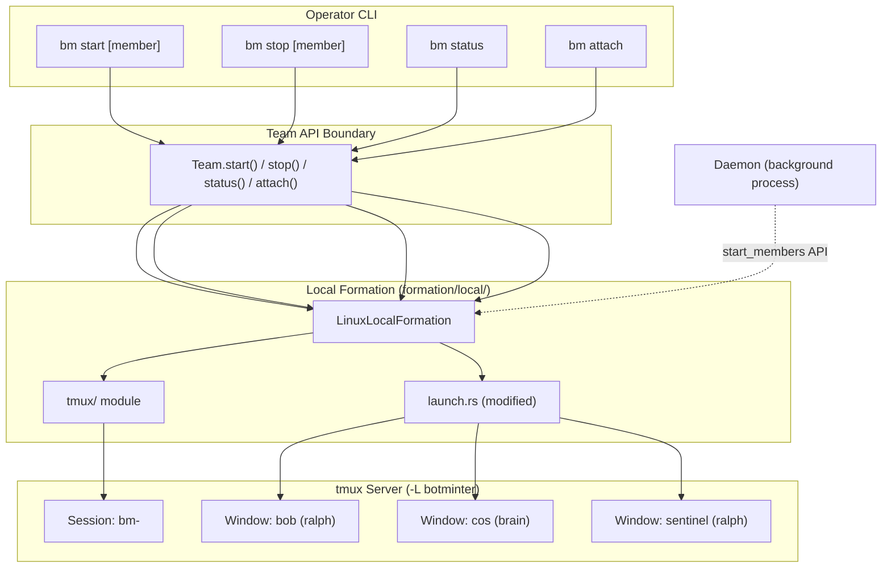
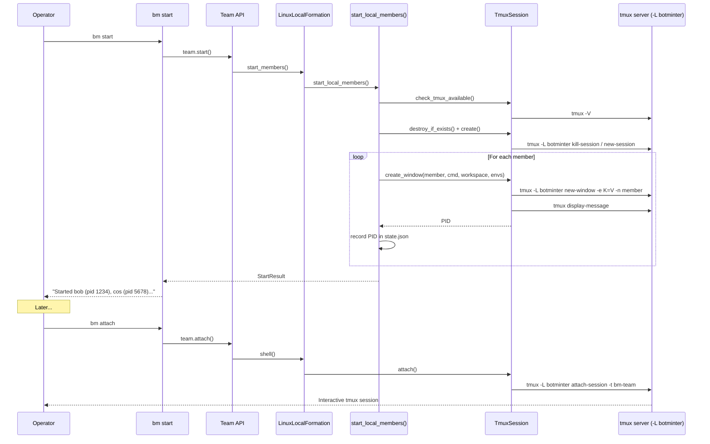

# Design — Tmux Agent Sessions

## Overview

This design adds tmux-based terminal multiplexing to the BotMinter local formation, replacing the current bare background process model for agent members. Each agent runs in a named tmux window within a single team session, providing real-time observability via `tmux attach`. The daemon remains a background process — only coding agents (Ralph orchestrator / brain processes) get tmux windows.

The design follows ADR-0008 (Formation as internal deployment strategy): tmux is a **formation concern**, not a command concern. Commands go through the Team API boundary; the local formation manages tmux internally as part of member lifecycle.

## Requirements Summary

References `requirements.md` by category:

- **TMUX** (TMUX-01 through TMUX-04): tmux required, version 3.0+, dedicated server socket
- **SESS** (SESS-01 through SESS-04): one session per team, one window per agent, direct stdio, daemon excluded
- **LIFE** (LIFE-01 through LIFE-04): kill-and-recreate on full start, additive on single start, post-mortem windows, all local launches through tmux
- **UX** (UX-01 through UX-03): `bm attach`, tmux info in `bm status`, attach hint
- **BRAND** (BRAND-01 through BRAND-03): custom tmux.conf, keybinding hints, ASCII art branding

## Architecture Overview



## Components and Interfaces

### 1. `formation/local/tmux/` Module (New)

A new domain module (per ADR-0006: directory modules only) that encapsulates all tmux interactions. Commands never call tmux directly — they go through Formation trait methods.

```
formation/local/tmux/
  mod.rs        # Public API: TmuxSession, TmuxConfig
  config.rs     # Embedded tmux.conf generation and writing
```

**`TmuxSession`** — manages a tmux server+session lifecycle:

```rust
pub struct TmuxSession {
    socket_name: String,   // "botminter" — the -L value
    session_name: String,  // "bm-<team>"
    config_path: PathBuf,  // ~/.botminter/tmux.conf
}

impl TmuxSession {
    /// Validates team_name against `[a-zA-Z0-9_-]` and constructs session/socket names.
    pub fn new(team_name: &str) -> Result<Self>;

    // Prerequisites
    pub fn check_tmux_available() -> Result<TmuxVersion>;

    // Session lifecycle
    pub fn exists(&self) -> bool;
    pub fn create(&self) -> Result<()>;
    pub fn destroy(&self) -> Result<()>;
    pub fn destroy_if_exists(&self) -> Result<()>;

    // Window lifecycle
    pub fn create_window(&self, name: &str, cmd: &[&str], cwd: &Path, envs: &[(&str, &str)]) -> Result<u32>;
    pub fn window_exists(&self, name: &str) -> bool;
    pub fn is_pane_dead(&self, window: &str) -> Result<bool>;
    pub fn kill_window_process(&self, name: &str) -> Result<()>;
    pub fn remove_window(&self, name: &str) -> Result<()>;
    pub fn remove_dead_window(&self, name: &str) -> Result<()>;

    // Querying
    pub fn list_windows(&self) -> Result<Vec<TmuxWindow>>;
    pub fn pane_pid(&self, window: &str) -> Result<u32>;

    // Operator interaction
    pub fn attach(&self, window: Option<&str>) -> Result<()>;
    pub fn session_info(&self) -> Result<SessionInfo>;
}

pub struct TmuxWindow {
    pub index: u32,
    pub name: String,
    pub pane_pid: u32,
    pub dead: bool,
}

pub struct TmuxVersion {
    pub major: u32,
    pub minor: u32,
}

pub struct SessionInfo {
    pub session_name: String,
    pub socket_name: String,
    pub windows: Vec<TmuxWindow>,
    pub attach_command: String,
}
```

All methods shell out to the `tmux` CLI via `std::process::Command`. We do NOT use the `tmux_interface` crate — shelling out is simpler, has zero dependencies, and gives full control over error handling (per the project's minimal-dependency approach).

**`TmuxConfig`** — manages the custom tmux configuration:

```rust
pub struct TmuxConfig;

impl TmuxConfig {
    /// Unconditionally writes the embedded config to ~/.botminter/tmux.conf
    /// with 0600 permissions. Uses atomic write (temp file + rename).
    pub fn ensure_written() -> Result<()>;

    /// Returns the path: ~/.botminter/tmux.conf
    pub fn path() -> PathBuf;

    pub fn config_content() -> &'static str;
}
```

The config content is a `const` string embedded in the binary (not `include_str!` from a file — it's small enough to inline). `ensure_written()` unconditionally writes it to `~/.botminter/tmux.conf` on every startup using atomic write (temp file + rename, same pattern as `state.json`). The file is set to `0600` permissions. No hash comparison — the file is small, BotMinter-owned, and the header says "do not edit." Unconditional overwrite is simpler and avoids edge cases around stale or tampered configs.

The `TmuxSession` resolves the config path internally via `TmuxConfig::path()` — callers of `TmuxSession` never need to thread the path through.

### 2. `formation/launch.rs` (Modified)

The existing `launch_ralph()` and `launch_brain()` functions change from spawning bare background processes to creating tmux windows.

**Current flow:**
```
Command::new("ralph") → stdin/stdout/stderr = null → child.spawn() → reap_child() → return PID
```

**New flow:**
```
TmuxSession::create_window(member_name, command_string, workspace, env_vars) → return PID from pane
```

The `TmuxSession` is passed into `launch_ralph()` and `launch_brain()` as a parameter. The functions build the command arguments and env var pairs, then delegate to `TmuxSession::create_window()` which:
1. Validates the window name against `[a-zA-Z0-9_-]` (rejects shell metacharacters)
2. Constructs the tmux command using `-e KEY=VALUE` flags for each env var (NOT shell string interpolation — secrets are never embedded in the command string)
3. Calls `tmux -L botminter new-window -t <session> -n <member> -c <workspace> -e K1=V1 -e K2=V2 -- <cmd> <args...>`
4. Queries `#{pane_pid}` to get the actual process PID inside the window (tmux forks the pane process synchronously during `new-window`, so `#{pane_pid}` is available immediately — no polling needed)
5. Validates the PID is alive via `kill(pid, 0)` — if the process already exited (e.g., binary not found, immediate crash), returns an error with the exit status from `#{pane_dead_status}` rather than a stale PID
6. Returns the PID for state.json tracking

**Security note:** The `-e` flag passes env vars via tmux's internal mechanism, not through the shell. This prevents secrets from appearing in `#{pane_start_command}` or in `ps` output. The command arguments are passed as a list (not a shell string), matching the current `Command::new()` pattern in `launch_ralph()`/`launch_brain()`.

Brain stderr continues to be tee'd to `brain-stderr.log` as a secondary diagnostic capture, providing a persistent log even after the tmux session is destroyed. The command run inside the tmux window sends stderr both to the pane (visible to operator) and to the log file (persistent artifact). This satisfies SESS-03 (stderr visible in pane) while retaining the existing diagnostic artifact.

**Signature changes:**

```rust
// Before
pub fn launch_ralph(workspace: &Path, ...) -> Result<u32>

// After
pub fn launch_ralph(tmux: &TmuxSession, workspace: &Path, ...) -> Result<u32>
pub fn launch_brain(tmux: &TmuxSession, config: &BrainLaunchConfig) -> Result<u32>
```

The `reap_child()` function becomes unused for member launches (tmux manages the process). It may be retained for other uses (daemon spawning).

### 3. `formation/start_members.rs` (Modified)

The `start_local_members()` function gains tmux session management at the orchestration level:

```
fn start_local_members(...) -> Result<StartResult> {
    // 1. Check tmux prerequisites (new)
    TmuxSession::check_tmux_available()?;
    TmuxConfig::ensure_written()?;

    // 2. Create TmuxSession handle (new)
    let tmux = TmuxSession::new(&team.name);

    // 3. Handle session lifecycle (new)
    if member_filter.is_none() {
        // Full team start: kill and recreate
        tmux.destroy_if_exists()?;
        tmux.create()?;
    } else {
        // Single member start: create if needed
        if !tmux.exists() {
            tmux.create()?;
        }
    }

    // 4. Existing member loop, but passing tmux to launch functions
    for member in members {
        // ... existing credential resolution ...

        // Skip if member already has a live window
        if tmux.window_exists(&member) && !tmux.is_pane_dead(&member)? {
            let running_pid = tmux.pane_pid(&member)?;
            warn!("Member '{}' is already running (pid {}). Use 'bm stop {}' first.", member, running_pid, member);
            continue;
        }

        // Clean up dead window from previous run before creating new one
        if tmux.window_exists(&member) && tmux.is_pane_dead(&member)? {
            tmux.remove_dead_window(&member)?;
        }

        let pid = if is_brain {
            launch_brain(&tmux, &config)?
        } else {
            launch_ralph(&tmux, workspace, ...)?
        };
        // ... existing state recording ...
    }
}
```

### 4. `formation/stop_members.rs` (Modified)

The stop logic changes to kill the process inside the tmux window but leave the window intact:

```rust
fn stop_member(tmux: &TmuxSession, member_name: &str, pid: u32) -> Result<()> {
    // Send SIGTERM to the process (existing behavior)
    kill(pid, SIGTERM);
    // Window stays alive due to remain-on-exit = on
    // Pane shows "Pane is dead (status N, timestamp)"
}
```

No tmux-specific stop logic needed — `remain-on-exit on` in the config keeps the window. The existing PID-based kill continues to work because the PID tracked in state.json is the actual process PID inside the pane (queried via `#{pane_pid}`), not the tmux server PID.

### 5. `formation/local/linux/mod.rs` (Modified)

**`check_prerequisites()`**: Add tmux availability check alongside the existing `ralph` check.

**`shell()`**: Currently returns an error ("not applicable for local formation"). Change to attach to the tmux session. Before attaching, print a brief tmux cheat sheet to stdout to help operators unfamiliar with tmux:

```rust
fn shell(&self, member: Option<String>) -> Result<()> {
    let tmux = TmuxSession::new(&self.team_name);
    if !tmux.exists() {
        bail!("No tmux session found. Start members first with: bm start");
    }
    // Print cheat sheet before exec-ing into tmux
    eprintln!("Attaching to tmux session '{}'...", tmux.session_name);
    eprintln!("  Ctrl-b n     next window");
    eprintln!("  Ctrl-b p     prev window");
    eprintln!("  Ctrl-b [     scroll mode (q to exit)");
    eprintln!("  Ctrl-b d     detach (return to shell)");
    eprintln!();
    tmux.attach(member.as_deref())  // None for full session, Some("bob") for direct window
}
```

**`member_status()`**: Optionally augment with tmux window state (dead/alive pane).

**`start_members()`**: The daemon-mediated path also needs tmux. Since `start_members()` delegates to the daemon HTTP API, and the daemon internally calls `start_local_members()`, the tmux integration happens inside `start_local_members()` — no change needed at the Formation trait level.

**Daemon tmux access:** The daemon process is spawned by `bm start` (or `bm daemon start`) and inherits the operator's environment, including `PATH` (which contains `tmux`). When the daemon's HTTP handler calls `start_local_members()`, that function constructs its own `TmuxSession` from the team name (available via the daemon's startup config and the `StartParams` struct). The daemon and all member processes run on the same host, so the tmux socket (`/tmp/tmux-<uid>/botminter`) is accessible. No daemon code changes are needed beyond what `start_local_members()` already provides.

### 6. `commands/attach.rs` (Modified)

The v2 formation path currently calls `local_formation.shell()` which errors. With this change, `shell()` attaches to the tmux session. The `bm attach` command accepts an optional member argument (`bm attach [member]`): when provided, the tmux session opens directly to that member's window. The `Formation::shell()` trait method gains an `Option<String>` parameter for the target member name.

### 7. `commands/status.rs` (Modified)

Add tmux session info to the `StatusInfo` struct and display:

```rust
// In state/dashboard.rs
pub struct StatusInfo {
    // ... existing fields ...
    pub tmux: Option<TmuxStatusInfo>,
}

pub struct TmuxStatusInfo {
    pub session_name: String,
    pub socket_name: String,
    pub window_count: usize,
    pub attach_command: String,          // "bm attach"
    pub raw_attach_command: String,      // "tmux -L botminter attach -t bm-<team>"
}
```

The status command displays:
```
  tmux: bm-may-team (3 windows)
  attach: bm attach  (or: tmux -L botminter attach -t bm-may-team)
```

### 8. Custom tmux.conf

The embedded configuration:

```
# BotMinter tmux configuration
# This file is auto-generated. Do not edit.

# ── Server settings ──────────────────────────────────
set -g default-terminal "screen-256color"

# ── Window behavior ──────────────────────────────────
set -wg automatic-rename off
set -wg allow-rename off
set -wg remain-on-exit on

# ── Scrollback ───────────────────────────────────────
set -g history-limit 50000

# ── Status bar ───────────────────────────────────────
set -g status on
set -g status-position bottom
set -g status-interval 5
set -g status-justify left

# Overall style
set -g status-style "bg=colour234,fg=colour137"

# Left: branding + session name
set -g status-left-length 50
set -g status-left "#[fg=colour39,bold] botminter #[fg=colour244]|#[fg=colour255] #S #[fg=colour244]| #[default]"

# Right: keybinding hints
set -g status-right-length 100
set -g status-right "#[fg=colour244] C-b n:next  C-b p:prev  C-b [:scroll  C-b d:detach #[fg=colour244]| #[fg=colour166]%H:%M #[default]"

# Window tabs
set -wg window-status-format "#[fg=colour244] #I:#W "
set -wg window-status-current-format "#[fg=colour81,bg=colour236,bold] #I:#W #[default]"
set -wg window-status-separator ""

# ── Mouse ────────────────────────────────────────────
set -g mouse on

# ── Security ─────────────────────────────────────────
# Prevent operator's env vars from leaking into agent sessions on attach.
# Tradeoff: the operator cannot pass env vars to agents via attach for debugging.
# This is intentional — agent env vars are set at launch time via -e flags.
# TERM is set at session creation and does not need updating on reattach.
set -g update-environment ""
```

The status bar shows:
```
 botminter | bm-may-team |  1:bob  2:cos  3:sentinel  | C-b n:next  C-b p:prev  C-b [:scroll  C-b d:detach | 14:23
```

## Data Models

### State Changes

`state.json` continues to track PID per member. The PID is now the process PID inside the tmux pane (obtained via `#{pane_pid}` after window creation), not a direct child PID. The `is_alive()` check (`kill(pid, 0)` + `/proc/<pid>/stat`) continues to work because the process runs on the same host.

No new fields are added to `MemberRuntime`. The tmux session name is deterministic (`bm-<team>`) and doesn't need to be stored — it can be derived from the team name at any time.

### Session Naming Convention

| Entity | Name | Example |
|--------|------|---------|
| tmux socket | `botminter` | `-L botminter` |
| tmux session | `bm-<team>` | `bm-may-team` |
| tmux window | `<member>` | `bob`, `cos`, `sentinel` |
| tmux target | `bm-<team>:<member>` | `bm-may-team:bob` |

## Error Handling

| Scenario | Behavior |
|----------|----------|
| tmux not installed | `bm start` fails with: "tmux is required but not found. Install it with: apt install tmux / dnf install tmux" |
| tmux version < 3.0 | `bm start` fails with: "tmux 3.0+ is required (found X.Y). Please upgrade." |
| Session already exists on full start | Destroy and recreate (LIFE-01) |
| Window name collision (live process) on single start | Skip member with message: "Member '<name>' is already running (pid <N>). Use 'bm stop <name>' first." |
| Window name collision (dead pane) on single start | Remove the dead window, then create a fresh one for the new member launch |
| tmux server dies mid-operation | Processes inside windows die (SIGTERM from tmux). State.json still has PIDs → `is_alive()` detects death → `cleanup_stale()` cleans up on next `bm start` or `bm status` |
| `bm attach` with no session | Error: "No tmux session found. Start members first with: bm start" |
| `bm attach` from inside tmux | Detect `$TMUX` env var and print a warning: "You are already inside a tmux session. BotMinter runs on a separate server (-L botminter). To avoid double-prefix issues, detach first (Ctrl-b d) then run 'bm attach'. Proceeding anyway..." Then proceed with the attach. |
| Manual session cleanup | Not a `bm` subcommand. Operators can destroy the tmux session manually with: `tmux -L botminter kill-session -t bm-<team>`. This clears all windows, dead panes, and scrollback. Normal workflow: `bm start` handles cleanup automatically (LIFE-01). |

## Acceptance Criteria

**AC-01:** Given tmux is not installed,
when the operator runs `bm start`,
then the command exits with a non-zero status,
and the error message names "tmux" as the missing dependency,
and the error message suggests installation commands for at least two package managers.
(Verifies TMUX-02)

**AC-02:** Given tmux is installed but the version is below 3.0,
when the operator runs `bm start`,
then the command exits with a non-zero status,
and the error message shows the found version number,
and the error message states that version 3.0+ is required.
(Verifies TMUX-03)

**AC-03:** Given a team with 3 members,
when the operator runs `bm start`,
then a tmux session named `bm-<team>` exists,
and the session uses the dedicated `botminter` socket (`-L botminter`),
and the session contains exactly 3 windows,
and each window is named after its corresponding member.
(Verifies TMUX-04, SESS-01, SESS-02)

**AC-04:** Given agents are running in tmux,
when `tmux -L botminter capture-pane -t bm-<team>:<member> -p` is polled at intervals within 10 seconds of agent startup,
then the captured output contains agent process output (stdout or stderr).
(Verifies SESS-03)

**AC-05:** Given agents are running in tmux,
when the operator lists tmux windows via `tmux -L botminter list-windows`,
then the daemon process name does not appear in any window name,
and the daemon PID is not the `#{pane_pid}` of any window.
(Verifies SESS-04)

**AC-06:** Given a tmux session `bm-<team>` exists from a previous run,
when the operator runs `bm start` (all members),
then the old session is destroyed,
and a new session `bm-<team>` is created with fresh windows.
(Verifies LIFE-01)

**AC-07a:** Given no tmux session exists,
when the operator runs `bm start bob`,
then a session `bm-<team>` is created,
and the session contains exactly one window named `bob`.
(Verifies LIFE-02, session creation path)

**AC-07b:** Given a tmux session `bm-<team>` exists with window `bob`,
when the operator runs `bm start cos`,
then a window `cos` is added to the existing session,
and window `bob` remains undisturbed with its original process still running.
(Verifies LIFE-02, additive window path)

**AC-08:** Given agents are running in tmux,
when the operator runs `bm stop`,
then all agent processes are terminated,
and the tmux windows remain in the session,
and each window shows "Pane is dead" status,
and scrollback content from before the stop is intact.
(Verifies LIFE-03)

**AC-09:** Given the daemon is running,
when a member start is triggered via the daemon's HTTP API (not via `bm start` CLI),
then the member runs inside a tmux window in the `bm-<team>` session,
and `tmux -L botminter list-windows` contains the member name.
(Verifies LIFE-04)

**AC-10:** Given agents are running in tmux,
when the operator runs `bm attach`,
then the operator is attached to the `bm-<team>` tmux session.
(Verifies UX-01)

**AC-10b:** Given agents are running in tmux,
when the operator runs `bm attach bob`,
then the operator is attached to the `bm-<team>` session with window `bob` selected.
(Verifies UX-01 — per-member attach)

**AC-11:** Given agents are running in tmux,
when the operator runs `bm status`,
then the output includes the tmux session name,
and the output includes the window count,
and the output includes the `bm attach` command.
(Verifies UX-02, UX-03)

**AC-12:** Given agents are running in tmux,
when the operator attaches to the session,
then a status bar is visible,
and the status bar contains the text "botminter",
and the status bar shows the session name,
and the status bar shows window tabs with member names.
(Verifies BRAND-01, BRAND-03 — status bar branding only; ASCII art deferred per D-05)

**AC-13:** Given the custom tmux.conf is loaded,
when the operator views the status bar,
then keybinding hints `C-b n:next`, `C-b p:prev`, `C-b [:scroll`, `C-b d:detach` are visible.
(Verifies BRAND-02)

**AC-14:** Given the operator is already inside a tmux session (`$TMUX` is set),
when the operator runs `bm attach`,
then a warning message is displayed about the nested session and how to detach,
and the attach proceeds.
(Verifies error handling — nested tmux detection)

**AC-15:** Given the operator's environment has `TMUX_TMPDIR` set to a shared directory,
when `bm start` creates the tmux session,
then the tmux socket is created under `/tmp/tmux-<uid>/` (the secure default),
and the socket is not created under the `TMUX_TMPDIR` path.
(Verifies D-09 — TMUX_TMPDIR security)

**AC-16:** Given agents are running in tmux,
when an observer runs `ps aux` and queries `tmux -L botminter display-message -t bm-<team>:<member> -p '#{pane_start_command}'`,
then no credential values (API tokens, bridge tokens) appear in the output.
(Verifies credential security via `-e` flag)

**AC-17:** Given `bm start` has been run,
then the file `~/.botminter/tmux.conf` exists,
and the file has `0600` permissions,
and the file contains the expected BotMinter configuration directives.
(Verifies D-02 — config file security)

**AC-18:** Given a tmux window `bob` exists with a dead pane (process exited),
when the operator runs `bm start bob`,
then the dead window is removed,
and a new window `bob` is created with a live process.
(Verifies dead-window cleanup)

**AC-19:** Given no tmux session exists,
when the operator runs `bm attach`,
then the command exits with error message "No tmux session found. Start members first with: bm start".
(Verifies error handling — attach with no session)

## Design Decisions

**D-01:** Use a dedicated tmux server socket (`-L botminter`)
- **Chosen:** Dedicated socket via `-L botminter`
- **Alternatives:** Default server (shared with user), per-team socket (`-L bm-<team>`)
- **Rationale:** Complete isolation from the user's personal tmux. Per-team socket is unnecessary since session names already namespace by team, and a single socket simplifies `bm attach`. Validated by Overmind and Agent Deck patterns (R-03).

**D-02:** Embed tmux.conf as a const string, unconditionally write to `~/.botminter/tmux.conf`
- **Chosen:** Const string in Rust source, unconditionally written to `~/.botminter/tmux.conf` at startup with `0600` permissions via atomic write
- **Alternatives:** `include_str!` from a file in the repo, ship as a separate file alongside the binary, generate dynamically per session, hash comparison to avoid unnecessary writes
- **Rationale:** Matches the project's existing pattern of embedding content in the binary (profiles use `include_dir`). The config is small and static. Writing to `~/.botminter/` keeps all BotMinter state in one place. Unconditional overwrite is simpler than hash comparison and ensures tampered or stale configs are always replaced. Atomic write (temp + rename) prevents partial writes. `0600` permissions prevent other users from reading or modifying the file.

**D-03:** tmux module lives in `formation/local/tmux/` as a formation concern
- **Chosen:** `formation/local/tmux/mod.rs` + `formation/local/tmux/config.rs`
- **Alternatives:** Top-level `tmux/` module, inside `commands/`, utility module
- **Rationale:** Per ADR-0008, member lifecycle is a formation concern. Per ADR-0006, new modules are directory modules. Per ADR-0007, domain logic lives in domain modules, not commands. The tmux module is local-formation-specific (Lima/K8s formations won't use it).

**D-04:** Use `remain-on-exit on` for post-mortem window retention
- **Chosen:** Global `remain-on-exit on` in the custom tmux.conf
- **Alternatives:** `remain-on-exit failed` (only on error), no remain-on-exit (destroy window), explicit `bm stop` handling
- **Rationale:** The operator wants to inspect agent output after stop regardless of exit code. `remain-on-exit on` is the simplest approach — works for both normal stop (SIGTERM → non-zero exit) and clean exit. Dead panes show exit status and timestamp automatically.

**D-05:** BRAND-03 satisfied by status bar text; ASCII art splash deferred
- **Chosen:** The "botminter" branding text in the status bar satisfies BRAND-03's "branding … in the status bar" variant
- **Alternatives:** ASCII art splash window on initial attach, welcome banner printed by `bm attach` before exec
- **Rationale:** BRAND-03 is should-have. The status bar is always visible and provides continuous branding. An ASCII art splash adds complexity (extra window or pre-attach stdout) for minimal value at alpha. Can be added later without design changes.

**D-06:** Shell out to tmux CLI, do not use `tmux_interface` crate
- **Chosen:** `std::process::Command` shelling out to `tmux`
- **Alternatives:** `tmux_interface` crate, tmux control mode (`-C`)
- **Rationale:** The project favors minimal dependencies (e.g., ADR-0010 chose a second binary target over a separate crate). The tmux CLI is the stable interface. Shelling out is 20 lines of straightforward code vs adding a crate dependency. Control mode is overkill for our needs.

**D-07:** No changes to `MemberRuntime` / `state.json` schema
- **Chosen:** Keep existing PID-based state tracking, derive tmux info from team name
- **Alternatives:** Add tmux_session/tmux_window fields to `MemberRuntime`
- **Rationale:** The tmux session name is deterministic (`bm-<team>`) and the window name equals the member name. No state needs to be stored — it's derivable. PID tracking still works because `#{pane_pid}` gives the actual process PID on the same host.

**D-08:** No trait abstraction over `TmuxSession` — concrete type, tested via real tmux
- **Chosen:** `TmuxSession` is a concrete struct, not a trait implementation. Launch functions accept `&TmuxSession` directly.
- **Alternatives:** Extract `SessionManager` trait with `TmuxSession` as one impl, allowing mock implementations for CI
- **Rationale:** The project does not use traits for other external tool wrappers (`gh` CLI, `ralph` CLI, `lima` CLI). The test philosophy is E2E against real infrastructure (ADR-0004, ADR-0009), not mocking. `check_prerequisites()` already checks for `ralph` in PATH the same static way. Adding a trait is premature abstraction for alpha — if tmux needs to be swapped for Zellij later, the trait can be extracted then. CI environments that run integration tests must have tmux installed, which is a trivial dependency (`apt install tmux`).

**D-09:** Unset `TMUX_TMPDIR` before tmux invocations to enforce default socket security
- **Chosen:** All `TmuxSession` methods unset `TMUX_TMPDIR` in the `Command` environment before invoking `tmux`
- **Alternatives:** Verify socket directory permissions after creation, use `-S` with an explicit socket path
- **Rationale:** tmux's default socket directory (`/tmp/tmux-<uid>/`) has `0700` permissions, which is secure. If `TMUX_TMPDIR` is inherited from the operator's environment and points to a shared location, the socket would be accessible to other users. Unsetting it ensures tmux always uses its secure default. This is cheaper and more robust than post-creation permission checks.

## Testing Strategy

### Unit Tests

- `TmuxSession::new()` constructs correct session/socket names
- `TmuxConfig::config_content()` is valid tmux syntax
- Session name derivation from team name

### Integration Tests

**Happy path:**
- tmux prerequisite check succeeds/fails based on PATH
- Session create/destroy lifecycle
- Window create/list/kill lifecycle
- `#{pane_pid}` returns correct PID for a known command
- `remain-on-exit` keeps window after process exits
- Dead window cleanup before re-creating a member window
- Config file written with correct permissions
- `update-environment ""` prevents env var propagation on attach
- Credential values not visible in `ps` output or `#{pane_start_command}`

**Failure paths:**
- `create_window` with invalid window name (shell metacharacters) returns validation error, not shell injection
- `create_window` when session does not exist returns a clear error
- `pane_pid` on a non-existent window returns an error
- `create_window` for a command that exits immediately: PID validation detects dead process and returns error with exit status
- `attach` with non-existent session returns actionable error

**Timing considerations:**
- Integration tests that check `is_pane_dead` after process kill use polling with timeout (not fixed sleeps) to avoid flaky CI

### E2E Tests

The existing E2E scenario structure (ADR-0004) covers the full operator journey. tmux behavior is verified within the existing `start → verify → stop` sequence:

- After `bm start`: verify tmux session exists with correct windows via `tmux -L botminter list-windows`
- After `bm stop`: verify windows still exist with dead panes
- `bm status`: verify tmux info in output
- `bm attach`: verify session attachment (test can detach immediately)

### Exploratory Tests

Per ADR-0009 and project CLAUDE.md, exploratory tests on `bm-test-user@localhost` must cover:
- tmux session creation across start/stop cycles
- Session cleanup on `bm start` (kill-and-recreate)
- Incremental window addition (`bm start <member>`)
- Post-mortem scrollback inspection after `bm stop`
- Daemon-triggered launches into tmux

## Impact on Existing System

### Changed Function Signatures

| Function | Change |
|----------|--------|
| `launch_ralph()` | Gains `tmux: &TmuxSession` parameter. No longer spawns `Command::new("ralph")` directly — delegates to `tmux.create_window()`. |
| `launch_brain()` | Gains `tmux: &TmuxSession` parameter. Brain stderr continues to be tee'd to `brain-stderr.log` alongside tmux pane output. |
| `start_local_members()` | Gains tmux session setup at the top (prerequisites check, session create/destroy). Passes `&tmux` to launch functions. Adds dead-window cleanup before each member launch. |
| `LinuxLocalFormation::shell()` | Changes from returning an error to attaching to the tmux session. |
| `LinuxLocalFormation::check_prerequisites()` | Adds tmux availability and version check. |
| `StatusInfo` (in `state/dashboard.rs`) | Gains `tmux: Option<TmuxStatusInfo>` field. |

### Backward Compatibility

The old bare-process launch path is **removed**, not feature-gated. This is consistent with the project's alpha policy: "Breaking changes are expected. No migration paths, no backwards compatibility shims." Operators who upgrade will get tmux-based launches automatically. tmux becomes a hard prerequisite.

### State Migration

No migration needed. `state.json` schema is unchanged — PID tracking works identically. Existing `state.json` files from pre-tmux era are compatible because PID values are still valid process IDs on the same host.

The `reap_child()` function is retained for daemon process spawning but is no longer used for member launches.

## Security Considerations

### Threat Model

Access to the tmux session is equivalent to full agent access. An attacker who can attach to the `botminter` socket can:
- Read all agent output (including any secrets logged during errors)
- Send keystrokes to agent processes
- Inspect agent environment variables

This is mitigated by tmux's default socket security: the socket lives in `/tmp/tmux-<uid>/` with `0700` directory permissions, accessible only to the running user. `TMUX_TMPDIR` is explicitly unset (D-09) to prevent inherited misconfigurations.

### Credential Handling

- **Environment variables:** Agent credentials (GitHub tokens, bridge tokens) are passed via tmux's `-e KEY=VALUE` flag, NOT as shell string interpolation. This prevents secrets from appearing in `#{pane_start_command}` metadata or `ps` output.
- **Scrollback:** Agent output may contain sensitive information in error traces. This is inherent to the observability requirement — you cannot observe agents without seeing their output. The 50,000-line scrollback buffer persists until the session is destroyed.
- **Post-mortem windows:** Dead panes from `bm stop` retain scrollback. On full `bm start`, the entire session is destroyed (LIFE-01), clearing all dead panes. On single-member restarts, dead windows are removed before creating new ones. For explicit cleanup, operators can run `tmux -L botminter kill-session -t bm-<team>`.
- **Config file:** Written with `0600` permissions via atomic write. The `~/.botminter/` directory is created with `0700` permissions by `config::config_dir()` (the existing helper used throughout the codebase). `TmuxConfig::ensure_written()` uses this same helper, so directory permission enforcement is handled by the shared code path.

### Socket Security

The `-L botminter` socket is created under `/tmp/tmux-<uid>/` with `0700` directory permissions (tmux default). All `TmuxSession` methods unset `TMUX_TMPDIR` to prevent redirection to a less secure location.

## Appendices

### Technology Choices

**tmux** selected over Zellij, GNU Screen, cmux, and others (see R-02). Key factors: `remain-on-exit` for post-mortem, `-L` for server isolation, universal Linux availability, 15+ years of stability.

### Existing Art

Patterns adopted from Overmind and Agent Deck (see R-03): dedicated socket isolation, window-per-process naming, custom config passthrough, tmux for observability (not supervision).

### Alternative Approaches

1. **Process Compose with built-in TUI** — rejected because it doesn't support interactive process stdin (needed for Ralph/Claude Code TUI agents)
2. **Zellij** — rejected due to incomplete post-mortem support (issue #707) and weaker Rust integration story
3. **No multiplexer (log files only)** — rejected as the status quo; fails the observability requirement

### Component Interaction Flow



## Traceability Matrix

| Requirement | Acceptance Criteria | Implementation Step | Verification Status |
|-------------|--------------------|--------------------|---------------------|
| TMUX-01 | AC-03 | STORY-01, STORY-03 | Pending |
| TMUX-02 | AC-01 | STORY-03, STORY-04 | Pending |
| TMUX-03 | AC-02 | STORY-01 | Pending |
| TMUX-04 | AC-03, AC-15 | STORY-01, STORY-03 | Pending |
| SESS-01 | AC-03 | STORY-03 | Pending |
| SESS-02 | AC-03 | STORY-02, STORY-03 | Pending |
| SESS-03 | AC-04 | STORY-03 | Pending |
| SESS-04 | AC-05 | STORY-03 | Pending |
| LIFE-01 | AC-06 | STORY-03 | Pending |
| LIFE-02 | AC-07a, AC-07b | STORY-03 | Pending |
| LIFE-03 | AC-08, AC-18 | STORY-02, STORY-03 | Pending |
| LIFE-04 | AC-09 | STORY-03 | Pending |
| UX-01 | AC-10, AC-14, AC-19 | STORY-04 | Pending |
| UX-02 | AC-11 | STORY-04 | Pending |
| UX-03 | AC-11 | STORY-04 | Pending |
| BRAND-01 | AC-12, AC-17 | STORY-01, STORY-04 | Pending |
| BRAND-02 | AC-13 | STORY-01, STORY-04 | Pending |
| BRAND-03 | AC-12 | STORY-01, STORY-04 | Pending |
