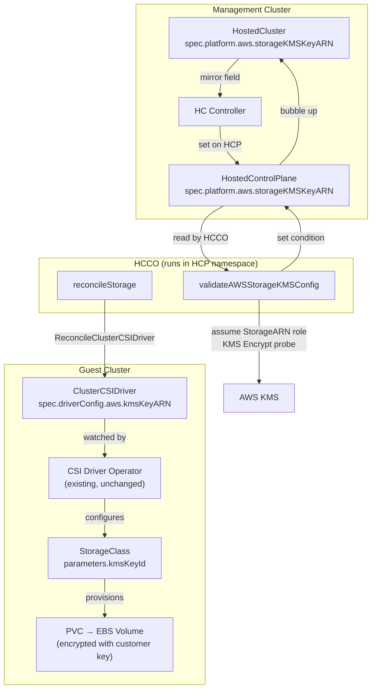

# Design: Export KMS Key ARN for Initial StorageClass in HyperShift

## Overview

This design adds a KMS key ARN field to the HyperShift API that enables ROSA HCP customers on AWS to specify a customer-managed KMS key for encrypting PVCs created by the default StorageClass. HyperShift propagates the key through the HostedCluster → HostedControlPlane → ClusterCSIDriver chain. The existing CSI driver operator in the guest cluster handles StorageClass configuration — no CSI operator changes are needed.

## Requirements Summary

This design addresses requirements from two domains in the project requirements catalogue:

- **KMS** (KMS-01 through KMS-07): Core KMS key ARN API field, propagation, day-2 mutability, clearing, format validation, status condition, and backward compatibility
- **CLI** (CLI-01, CLI-02): HCP CLI and HyperShift dev CLI flag support

Full requirement text: [kms.md](../../requirements/kms.md), [cli.md](../../requirements/cli.md)

## Architecture Overview



### Data Flow

1. Customer sets `storageKMSKeyARN` on HostedCluster (via API or CLI)
2. HC controller mirrors the field to HostedControlPlane
3. HCCO validates the key via AWS KMS `Encrypt` probe by assuming the `StorageARN` role (using the same credential mechanism that provisions `ebs-cloud-credentials` for the CSI driver)
4. HCCO sets `ValidAWSStorageKMSConfig` condition on HCP status; HC controller bubbles it to HostedCluster status
5. HCCO `reconcileStorage` passes the KMS key ARN to `ReconcileClusterCSIDriver`
6. `ReconcileClusterCSIDriver` sets `ClusterCSIDriver.Spec.DriverConfig.AWS.KMSKeyARN` in the guest cluster
7. CSI driver operator reads ClusterCSIDriver and configures the default StorageClass with the KMS key (the value is passed through verbatim — alias ARNs are resolved by AWS at volume creation time)
8. New PVCs provisioned via the StorageClass are encrypted with the customer's key

## Components and Interfaces

### API Changes

**New field on `AWSPlatformSpec`** (`api/hypershift/v1beta1/aws.go`):

```go
type AWSPlatformSpec struct {
    // ... existing fields ...

    // StorageKMSKeyARN is the ARN of the customer-managed AWS KMS key
    // for encrypting PVCs created by the default StorageClass.
    // The value may be either a KMS key ARN or a KMS alias ARN.
    // When set, HyperShift propagates this to ClusterCSIDriver.Spec.DriverConfig.AWS.KMSKeyARN.
    // When empty, the default StorageClass uses AWS-managed encryption.
    // +optional
    // +kubebuilder:validation:XValidation:rule="self == '' || self.matches('^arn:(aws|aws-cn|aws-us-gov):kms:[a-z0-9-]+:[0-9]{12}:(key|alias)/[a-zA-Z0-9:/_-]+$')",message="storageKMSKeyARN must be a valid KMS key or alias ARN"
    // +kubebuilder:validation:MaxLength=2048
    StorageKMSKeyARN string `json:"storageKMSKeyARN,omitempty"`
}
```

The same field is added to `AWSPlatformSpec` on both `HostedCluster` and `HostedControlPlane` types (they share the struct definition).

### HC Controller — Field Mirroring

The HC controller (`hypershift-operator/controllers/hostedcluster/`) must mirror `storageKMSKeyARN` from HostedCluster to HostedControlPlane, following the existing pattern for other `AWSPlatformSpec` fields.

### HCCO — KMS Key Validation

A new `validateAWSStorageKMSConfig` function in the HCCO resources controller, following the existing `validateAWSKMSConfig` pattern from the CPO but running in the HCCO context where `StorageARN` role credentials are available:

1. If `storageKMSKeyARN` is empty → set condition `Unknown` / `StatusUnknown` with message `"Storage KMS is not configured"`
2. Assume the `StorageARN` role using the same credential mechanism that provisions `ebs-cloud-credentials` for the CSI driver
3. Call KMS `Encrypt` with a test payload using the specified key ARN
4. Success → set `ValidAWSStorageKMSConfig` = `True` / `AsExpected` with message `"Storage KMS key is valid and accessible"`
5. Failure → set `ValidAWSStorageKMSConfig` = `False` with reason and message including: the failing ARN, the AWS error code/message, and a remediation hint (e.g., `"KMS key arn:aws:kms:...:key/abc123 is not accessible: AccessDeniedException. Verify the StorageARN role has kms:Encrypt permission on this key."`)

The HCCO is the correct location for this validation because the `StorageARN` role's trust policy is scoped to service accounts in the HCP namespace — the CPO cannot assume this role without additional trust policy configuration.

### HCCO — Reconcile Changes

`reconcileStorage` in `control-plane-operator/hostedclusterconfigoperator/controllers/resources/storage/reconcile.go`:

- Read `hcp.Spec.Platform.AWS.StorageKMSKeyARN`
- Pass to `ReconcileClusterCSIDriver` (new parameter or struct)
- `ReconcileClusterCSIDriver` sets `driver.Spec.DriverConfig` with `DriverType: AWSDriverType` and `AWS.KMSKeyARN` when the field is non-empty
- When the field is empty, `DriverConfig` is left unset (or cleared), reverting to AWS default encryption

### CLI Changes

Both CLIs share `cmd/cluster/aws/create.go` via `bindCoreOptions`.

- New field `StorageKMSKeyARN string` in `RawCreateOptions`
- New flag `--storage-volumes-kms-key` bound in `bindCoreOptions` (exposes to both HCP and dev CLIs automatically)
- Wire in `ApplyPlatformSpecifics` to set `HostedCluster.Spec.Platform.AWS.StorageKMSKeyARN`

## Data Models

### API Type Addition

| Struct | Field | Type | Validation | JSON |
|--------|-------|------|------------|------|
| `AWSPlatformSpec` | `StorageKMSKeyARN` | `string` | CEL regex + MaxLength=2048 | `storageKMSKeyARN,omitempty` |

### ClusterCSIDriver (existing, no changes)

| Struct | Field | Type | Notes |
|--------|-------|------|-------|
| `AWSCSIDriverConfigSpec` | `KMSKeyARN` | `string` | Already exists in vendored API, `omitempty` |

### CLI Options

| Struct | Field | Type | Flag |
|--------|-------|------|------|
| `RawCreateOptions` | `StorageKMSKeyARN` | `string` | `--storage-volumes-kms-key` |

## Error Handling

| Scenario | Handling | User-Visible Effect |
|----------|----------|-------------------|
| Invalid ARN format | CEL validation rejects at admission | API error: "storageKMSKeyARN must be a valid KMS key or alias ARN" |
| Valid ARN but key inaccessible (IAM) | HCCO validation sets condition False | `ValidAWSStorageKMSConfig=False`, reason `InvalidIAMRole`, message includes failing ARN and remediation hint |
| Valid ARN but key disabled/deleted | HCCO validation sets condition False | `ValidAWSStorageKMSConfig=False`, reason `AWSError`, message includes failing ARN and AWS error details |
| Key accessible but PV provisioning fails | CSI operator reports degraded | `ClusterVersionSucceeding` degrades via CVO chain |
| ARN cleared (empty string) | DriverConfig cleared, CSI operator reverts StorageClass | PVCs use AWS-managed encryption |

## Acceptance Criteria

**AC-01:** Given an AWS HostedCluster, when a customer specifies a valid KMS key ARN in `storageKMSKeyARN`, then the API accepts the value and the field is persisted on the HostedCluster resource.
*Verifies: KMS-01*

**AC-02:** Given a KMS key ARN is configured on a HostedCluster, when a PVC is created using the default StorageClass in the guest cluster, then the resulting EBS volume is encrypted with the specified KMS key.
*Verifies: KMS-02*

**AC-03:** Given an existing HostedCluster with a KMS key ARN, when the customer updates the `storageKMSKeyARN` to a different valid ARN, then new PVCs are encrypted with the updated key. Existing PVs retain encryption with the original key.
*Verifies: KMS-03*

**AC-04:** Given an existing HostedCluster with a KMS key ARN, when the customer clears `storageKMSKeyARN` (sets to empty), then new PVCs use AWS default encryption.
*Verifies: KMS-04*

**AC-05:** Given an AWS HostedCluster, when a customer specifies an invalid KMS key ARN format (e.g., missing prefix, wrong partition, malformed key ID), then the API rejects the request with a validation error message.
*Verifies: KMS-05*

**AC-06:** Given a valid and accessible KMS key ARN is configured, when the HCCO validates the key, then the `ValidAWSStorageKMSConfig` condition on the HostedCluster reports `True` with reason `AsExpected`.
*Verifies: KMS-06*

**AC-07:** Given an invalid or inaccessible KMS key ARN is configured, when the HCCO validates the key, then the `ValidAWSStorageKMSConfig` condition on the HostedCluster reports `False` with a descriptive reason (`AWSError` or `InvalidIAMRole`) and a message that includes the failing ARN and remediation guidance.
*Verifies: KMS-06*

**AC-08:** Given an AWS HostedCluster with no `storageKMSKeyARN` set, when PVCs are created via the default StorageClass, then they use AWS default encryption and the `ValidAWSStorageKMSConfig` condition is `Unknown` with reason `StatusUnknown`.
*Verifies: KMS-07*

**AC-09:** Given the HCP CLI, when a customer runs cluster creation with `--storage-volumes-kms-key <ARN>`, then the resulting HostedCluster has `storageKMSKeyARN` set to the provided value.
*Verifies: CLI-01*

**AC-10:** Given the HyperShift dev CLI, when a developer runs cluster creation with `--storage-volumes-kms-key <ARN>`, then the resulting HostedCluster has `storageKMSKeyARN` set to the provided value.
*Verifies: CLI-02*

## Design Decisions

**D-01:** API field placement — add `StorageKMSKeyARN` to `AWSPlatformSpec`
- **Chosen:** Add the field directly to the existing `AWSPlatformSpec` struct shared by HostedCluster and HostedControlPlane
- **Alternatives:** (a) New nested struct `AWSStorageConfig` under `AWSPlatformSpec`; (b) Separate top-level `StorageEncryption` section on the HostedCluster spec
- **Rationale:** `AWSPlatformSpec` already contains all AWS-specific platform configuration. A nested struct adds indirection for a single field. A top-level section would break the existing pattern where platform-specific config lives under `spec.platform.<provider>`. The existing `RootVolume.EncryptionKey` on NodePool follows this same pattern — platform-specific encryption fields sit in the platform struct.

**D-02:** Validation mechanism — CEL admission rules with alias ARN support
- **Chosen:** CEL validation rule on the `StorageKMSKeyARN` field using the regex `^arn:(aws|aws-cn|aws-us-gov):kms:[a-z0-9-]+:[0-9]{12}:(key|alias)/[a-zA-Z0-9:/_-]+$`
- **Alternatives:** (a) Webhook-based validation; (b) Minimal `^arn:` prefix check like `AWSKMSKeyEntry.ARN`; (c) Key ARNs only (no alias support)
- **Rationale:** Per project convention (`.claude/rules/webhook-validation.md`), new validation MUST use CEL rules. The regex accepts both key ARNs and alias ARNs, matching the downstream `ClusterCSIDriver` CRD validation which explicitly supports both (`"The value may be either the ARN or Alias ARN of a KMS key"`). The CSI operator passes the value verbatim to `StorageClass.Parameters["kmsKeyId"]` — alias resolution happens at the AWS API level during volume creation. Source: R-01, CSI operator research.

**D-03:** KMS key validation strategy — active probe in HCCO via `StorageARN` role
- **Chosen:** Active KMS `Encrypt` probe in the HCCO (not CPO), following the `ValidAWSKMSConfig` pattern: HCCO assumes the `StorageARN` role and calls KMS `Encrypt` to verify key accessibility
- **Alternatives:** (a) Run validation in CPO (original design — rejected because the `StorageARN` role's trust policy is scoped to service accounts in the HCP namespace, not the CPO's SA); (b) Propagation confirmation only — verify ARN was written to ClusterCSIDriver (lighter but doesn't detect key permission issues until volume creation fails); (c) Rely on existing CVO chain — KMS failures surface as generic storage degradation (no new code but lossy, delayed, not actionable per R-05)
- **Rationale:** The HCCO has access to the `StorageARN` role credentials (same mechanism used to provision `ebs-cloud-credentials` for the CSI driver). The active probe provides fast, actionable feedback before any PVC creation attempt. The HCCO resources controller already sets conditions on HCP status (e.g., `DataPlaneConnectionAvailable`), so the pattern is established. Source: R-05, Q-08, adversarial review (Staff Engineer).

## Testing Strategy

### Unit Tests

- **API validation tests:** Valid key ARN accepted, valid alias ARN accepted, invalid ARN formats rejected (missing prefix, wrong partition, malformed key ID, exceeds MaxLength, alias ARN with invalid characters)
- **HC controller tests:** `storageKMSKeyARN` correctly mirrored from HostedCluster to HostedControlPlane
- **HCCO validation tests:** Condition set correctly for each scenario (no key → Unknown, valid key → True, invalid role → False, failed encrypt → False); condition messages include failing ARN and remediation hint
- **Reconcile tests:** `ReconcileClusterCSIDriver` correctly sets/clears `DriverConfig.AWS.KMSKeyARN`; when field is empty, `DriverConfig` is cleared (downgrade safety)
- **CLI tests:** `--storage-volumes-kms-key` flag parsed and wired to HostedCluster spec

### E2E Tests

- Create an AWS HostedCluster with `--storage-volumes-kms-key <test-key-ARN>`
- Verify `ValidAWSStorageKMSConfig` condition becomes `True`
- Create a PVC in the guest cluster using the default StorageClass
- Verify the resulting EBS volume is encrypted with the specified KMS key (AWS API check)
- Update the KMS key ARN → verify new PVCs use updated key
- Clear the KMS key ARN → verify new PVCs use AWS default encryption

### Regression

- Verify HostedClusters created without `storageKMSKeyARN` behave identically to before (no condition set, default encryption)

## Security Considerations

- **No new IAM permissions:** The `StorageARN` role in `AWSRolesRef` must already have KMS key access for the feature to work. No new roles or policies are introduced.
- **ARN format validation:** CEL regex prevents injection of malformed ARN strings at admission time.
- **Key access verification:** Active KMS probe verifies the key is accessible before any volume is created, preventing silent failures.
- **No key material exposure:** Only the ARN (a reference) is propagated — no key material is ever handled by HyperShift.
- **Cross-account keys:** The ARN format supports cross-account KMS keys. Access depends on the IAM role's key policy — this is an AWS-level concern, not a HyperShift concern.

## Observability

- **`ValidAWSStorageKMSConfig` condition:** Surfaced on HostedCluster status. Shows `True`/`False`/`Unknown` with reason codes (`AsExpected`, `AWSError`, `InvalidIAMRole`, `StatusUnknown`).
- **Existing CVO chain:** Storage operator degradation already propagates to HostedCluster via `ClusterVersionSucceeding` as a secondary signal.
- **Metrics:** No new metrics are introduced. The existing condition-based alerting in ROSA (condition monitoring) will automatically pick up the new condition type.
- **Logging:** Standard controller-runtime structured logging in HCCO validation and reconcile functions.

## Performance

- **Reconcile impact:** Adding one field to `ReconcileClusterCSIDriver` has negligible impact. The function already runs as part of the HCCO reconcile loop.
- **KMS probe latency:** The `Encrypt` API call adds latency to the HCCO reconcile loop. This follows the existing `ValidAWSKMSConfig` pattern from the CPO — the probe runs on the HCCO's reconcile interval, not on every API request.
- **No hot-path changes:** Validation is CEL-based (admission-time, minimal overhead). Reconciliation is background (controller loop). No request-path latency impact.

## Migration & Compatibility

- **Backward compatible:** The new field is optional with `omitempty`. Existing HostedClusters without the field continue to work identically.
- **No data migration:** No existing data needs to be transformed.
- **API versioning:** The field is added to the existing `v1beta1` API version. No new API version is needed.
- **Upgrade path:** On upgrade, existing clusters gain the field (defaulting to empty). No action required from customers.
- **Downgrade consideration:** If a cluster is downgraded to a version without this field, the `storageKMSKeyARN` value is silently dropped. The ClusterCSIDriver in the guest cluster retains its last-set `DriverConfig` until the CSI operator reconciles — eventual consistency via the CSI operator.

## Impact on Existing System

### Changed Components

| Component | Change | Blast Radius |
|-----------|--------|--------------|
| `api/hypershift/v1beta1/aws.go` | New field on `AWSPlatformSpec` | API type change — requires `make generate` for CRDs, deepcopy, client-gen |
| HC controller | Mirror `storageKMSKeyARN` field | Small addition to existing mirroring logic |
| HCCO resources controller | New `validateAWSStorageKMSConfig` function | New validation function using StorageARN role credentials |
| HCCO reconcile | Pass KMS key to `ReconcileClusterCSIDriver` | Signature change on `ReconcileClusterCSIDriver` |
| `storage/reconcile.go` | Set `DriverConfig.AWS.KMSKeyARN` | Small addition to existing reconcile function |
| CLI `cmd/cluster/aws/create.go` | New flag and wiring | Addition to existing flag binding |
| `conditions.go` | New condition type constant | One new const |

### Unchanged Components

- CSI driver operator (reads ClusterCSIDriver spec — no changes)
- CSI driver (uses StorageClass parameters — no changes)
- NodePool (root volume encryption is separate and unchanged)
- Etcd encryption (separate KMS key, separate validation — unaffected)

## Documentation Impact

- **User guide:** Document the new `storageKMSKeyARN` field on HostedCluster for ROSA HCP customers, including day-2 key rotation behavior and the warning about existing PVs retaining the original key
- **CLI reference:** Document `--storage-volumes-kms-key` flag for `hcp create cluster aws` and `hypershift create cluster aws`
- **API reference:** Auto-generated from the Go type annotations
- **Troubleshooting:** Document `ValidAWSStorageKMSConfig` condition meanings and how to diagnose KMS permission issues
- **Changelog:** Entry for the new feature in the release notes

## Appendices

### A. Technology Choices

| Choice | Selected | Rationale |
|--------|----------|-----------|
| Validation | CEL admission rules | Project convention — webhooks are prohibited for new validation |
| ARN regex | `^arn:(aws\|aws-cn\|aws-us-gov):kms:[a-z0-9-]+:[0-9]{12}:(key\|alias)/[a-zA-Z0-9:/_-]+$` | Matches downstream ClusterCSIDriver CRD validation; accepts both key and alias ARNs |
| Key validation | Active KMS Encrypt probe in HCCO | Proven pattern from `ValidAWSKMSConfig`; runs in HCCO where StorageARN credentials are available |
| CLI flag | `--storage-volumes-kms-key` | Consistent with existing `--root-volume-kms-key` naming pattern |

### B. Research Findings Summary

- **R-01:** Three validation levels exist in the codebase; full CEL regex is the current standard for new KMS fields
- **R-02:** `ClusterCSIDriver.Spec.DriverConfig.AWS.KMSKeyARN` already exists in vendored API; clearing (empty string) reverts to default
- **R-03:** `reconcileStorage` has full access to HCP spec; the call site naturally fits platform-specific KMS propagation
- **R-04:** Both CLIs share `bindCoreOptions` — adding a flag there exposes it in both CLIs automatically
- **R-05:** Active KMS probe pattern exists for etcd encryption; storage conditions propagate indirectly via CVO chain (lossy); new dedicated condition provides fast, actionable feedback

### C. Alternative Approaches

1. **Per-StorageClass KMS key:** Rejected — the CSI operator's `ClusterCSIDriver.DriverConfig` applies to all StorageClasses managed by that driver. Per-SC granularity would require CSI operator changes, which is out of scope.
2. **Nested `AWSStorageConfig` struct:** Rejected — adds indirection for a single field. Can be introduced later if more storage-specific fields are needed.
3. **Rely on CVO chain for status:** Rejected — lossy (generic "storage degraded" message), delayed (CVO reconcile cycle), not actionable for KMS-specific diagnosis.

## Traceability Matrix

| Requirement | Acceptance Criteria | Story | Verification Status |
|-------------|--------------------|--------------------|---------------------|
| KMS-01 | AC-01 | STORY-01 | Pending |
| KMS-02 | AC-02 | STORY-02 | Pending |
| KMS-03 | AC-03 | STORY-02 | Pending |
| KMS-04 | AC-04 | STORY-02 | Pending |
| KMS-05 | AC-05 | STORY-01 | Pending |
| KMS-06 | AC-06, AC-07 | STORY-03 | Pending |
| KMS-07 | AC-08 | STORY-01 | Pending |
| CLI-01 | AC-09 | STORY-04 | Pending |
| CLI-02 | AC-10 | STORY-04 | Pending |
